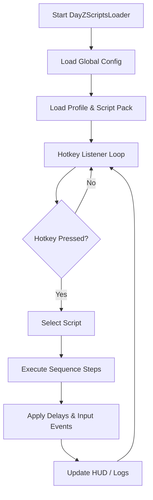

## 🌍 Overview

The **DayZ Scripts Automation Tool** is a lightweight, external control layer that listens for your hotkeys and executes scripted sequences of actions, camera moves, and timing routines.

Instead of manually:

* Bandaging, repositioning, and re-aiming
* Doing the same loot sweep in the same building
* Cycling through medical/food slots mid-panic
* Toggling scopes, stances, and small adjustments

…you bind these patterns to **modular scripts**. The goal isn’t to trivialize DayZ—it’s to remove mechanical clutter so you can pay attention to the horizon, the soundscape, the *story*.

Core ideas:

* **Automation** of repetitive micro-actions
* **Consistency** in movement and combat routines
* **Customization** via profiles and script packs
* **Clarity** through optional HUD hints and logging

---

## 🎯 Key Features

### 🧭 1. Survival Macro Engine

String your common actions into scripts and fire them with a single key.

* Healing chains (bandage → morphine → reposition)
* “Camp ready” sequences (crouch, shoulder switch, check surroundings)
* Loot sweeps (open, scroll, pick, exit, step forward)
* Food/water cycle routines
* Panic buttons for “drop prone, pivot, check doorway”

Example “Emergency Prone & Scan” script:

```ini
[meta]
name = "EmergencyProneScan"
key  = "CTRL+X"

[sequence]
step1 = "stance_prone"
step2 = "turn -45"
step3 = "hold 400"
step4 = "turn 90"
step5 = "hold 400"
step6 = "reset_turn"
```

---

### 🔭 2. Soft Vision & Awareness Helpers

Not full-on ESP—just small scriptable hints and consistency aids.

* Scripted zoom toggles for quick peeks
* Scope-switch cycles for multi-optic setups
* Configurable “scan arcs” that nudge view in a pattern
* HUD markers for “last script execution” and cooldowns
* Optional subtle crosshair pulse when a scan script completes

[!IMPORTANT]
Vision helpers are designed to complement your awareness, not spam the screen. You control intensity and frequency via config.

---

### 🎒 3. Loot & Inventory Routines

Turn your loot routes into something smoother, calmer, repeatable.

* Scripted building entry/exit patterns
* Auto-organize sequences (move ammo → stack → check mags)
* Context-based hotkeys (one key for “medical slot”, another for “food”)
* “Pack & go” scripts for leaving a base or stash quickly
* Optional log output for tracking how long your runs actually take

Snippet from a minimalist loot script:

```ini
[meta]
name = "QuickLootDoor"
key  = "E"

[sequence]
step1 = "open_door"
step2 = "hold 150"
step3 = "step_forward"
step4 = "interact"
```

---

### 🏃 4. Movement & Traversal Scripts

Surviving is often about *how* you move.

* Scripted sidestep dodges
* Peek-lean patterns around doorways
* Sprint → slide → crouch chains
* Gentle camera tilt & re-center routines for long road runs
* “Cliff or ladder approaches” scripted for safer positioning

---

### 🧩 5. Profile-Based Script Packs

Switch the way your whole tool behaves depending on the life you’re living today:

* **Coastal Nomad** — loot and basic combat helpers
* **Town Rat** — tight building runs, window peeks, fast inventory work
* **Treeline Hunter** — movement arcs and scoped scanning scripts
* **Base Rat** — stash management, crafting, storage routines
* **Night Walker** — slow, quiet motion emphasizing scanning and minimal inputs

Each profile is just a bundle of `.dzs` files and a `.profile` descriptor.
## ⚡ Quick Setup & First Run

Before we dive into poetic survival, let’s get the tool breathing alongside your game.

### 1️⃣ Install & Folder Layout

```bash
mkdir C:\DayZScriptsSuite\
move DayZScriptsLoader.exe C:\DayZScriptsSuite\
mkdir C:\DayZScriptsSuite\scripts
mkdir C:\DayZScriptsSuite\profiles
```

### 2️⃣ Launch With a Profile

```bash
DayZScriptsLoader.exe --profile=coastal_nomad
```

The loader attaches the runtime engine, loads your script pack, and activates your chosen hotkeys and overlays.

### 3️⃣ Basic Script Structure

Each script lives as a `.dzs` file (simple, human-readable syntax):

```ini
[meta]
name = "QuickBandage"
key  = "ALT+B"

[sequence]
step1 = "select_item bandage"
step2 = "use_item"
step3 = "hold 1200"       ; milliseconds
step4 = "recenter_view"
```

[!NOTE]
Scripts are meant to automate *inputs and routines*, not to replace decision-making. You’re still the survivor; this tool just carries some of the weight.

---

## 🛠 Configuration & Script Management

### Global Config

Global behavior lives in `config.ini`:

```ini
[engine]
poll_rate_ms = 8
log_level    = "info"

[hud]
show_status  = true
anchor       = "top_right"

[input]
anti_repeat_ms = 200
```

### Per-Profile Settings

`coastal_nomad.profile`:

```ini
[meta]
label     = "Coastal Nomad"
color     = "#7FD1FF"

[scripts]
includes  = [
  "QuickBandage.dzs",
  "EmergencyProneScan.dzs",
  "QuickLootDoor.dzs",
  "RunScanShort.dzs"
]
```

### Script Reloading

You can reload scripts live without closing the tool:

```bash
DayZScriptsLoader.exe --reload
```

---

## 🔄 Mermaid Diagram – Script Execution Flow



---

## ❓ FAQ

### Does this tool write or modify game files?

No. It sends input sequences and manages its own configs; it doesn’t patch game files or assets.

### Can I build fully custom scripts from scratch?

Yes. Any sequence of supported actions (`stance_*`, `turn`, `interact`, `hold`, `step_*`, etc.) can be composed into a `.dzs` file.

### What happens if two scripts share the same key?

The loader will warn you on startup and prioritize the script listed last in the profile. It’s best to keep bindings unique per profile.

### Will scripts break if my keybinds differ from default?

If your in-game keybinds are heavily customized, you may need to adjust script actions or the tool’s input map. That’s why profiles & configs are exposed in plain text.

### Can I have separate setups for different servers?

Absolutely. Create multiple profiles (e.g., `hardcore_fpp.profile`, `modded_civilian.profile`) and launch with the corresponding flag.

---

## 🌫 Final Thoughts

There’s a special rhythm to DayZ when the little things stop tripping you up—when bandaging feels like a verse, looting a familiar chorus, scanning the treeline a quiet refrain.

The **DayZ Scripts Automation Tool** isn’t about invincibility; it’s about *flow*. It keeps the busywork in the background so your mind can stay on the sky, the trees, the echo of distant shots, the story you’re writing with every step.

You’ll still starve if you’re careless. You’ll still bleed if you overextend. But with your routines scripted and your hands a little lighter, you’re free to pay attention to what really matters: the world itself.

Walk softly. Script the rest.

---
